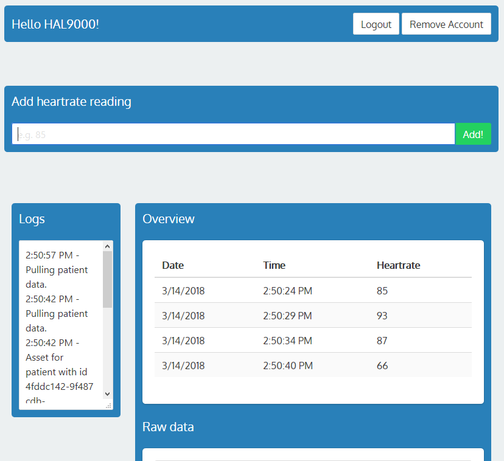

# BlockBeat

## A POC application that stores medical readings on the test [BigchainDB](https://www.bigchaindb.com/).

This is a small project that I created to get used to working with [BigchainDB](https://www.bigchaindb.com/). Data on [BigchainDB](https://www.bigchaindb.com/) consists of asssets, and these assets can be transferred/updated.  
Every transaction (creation or transfer of an asset) allows you to append metadata, which can be used to store more changeable information.
